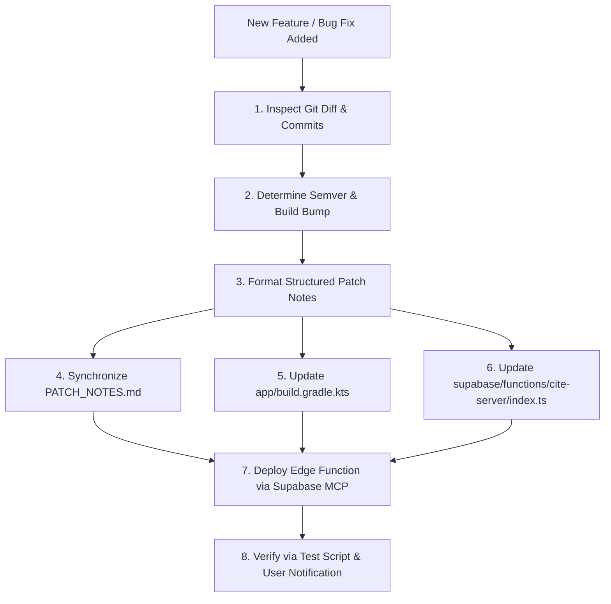

# Patch Notes Manager

The **Patch Notes Manager** governs the end-to-end lifecycle of versioning, changelog generation, and user-facing release notes for the Cite Circle platform.

Whenever a new feature is merged, an architectural change is made, or a bug is resolved, this skill guarantees that:
1. `PATCH_NOTES.md` is updated with a structured release log.
2. The Android application version (`versionCode` & `versionName` in `app/build.gradle.kts`) is bumped.
3. The serverless update engine (`supabase/functions/cite-server/index.ts`) is synchronized so that the in-app version checker delivers the exact latest notes to users.

---

## When to Run This Skill

Run this workflow whenever ANY of the following occur:
- A new feature or major enhancement is added (e.g., Gemini model additions, UI screens, storage backends).
- Critical bugs or stability fixes are merged (e.g., memory leak fixes, crash resolutions, role desync).
- A new APK build is published or prepared for distribution.
- The user requests: "update patch notes", "create a patch note", "bump version", or "show latest configuration".

---

## Step-by-Step Workflow



### 1. Inspect Recent Changes
Extract the commits and modified files since the last release tag or version commit:
```bash
git log -n 10 --oneline
git diff --stat HEAD~1
```
Categorize changes into:
- **🚀 Highlights**: 1-2 sentence executive summary of major milestones.
- **Added**: New capabilities, screens, endpoints, or UI actions.
- **Fixed**: Resolved bugs, edge cases, crash mitigations, or memory leaks.
- **Improved**: Performance, caching, UI responsiveness, or styling tweaks.
- **Security**: Auth policies, RLS guards, encryption, or file sanitization.

---

### 2. Determine Version Bump
Cite Circle follows [Semantic Versioning](https://semver.org/):
- **Major (`X.0.0`)**: Breaking database changes, complete UI overhauls.
- **Minor (`1.X.0`)**: Substantial feature additions (e.g. Gemini AI, Real-time WebSocket notifications).
- **Patch (`1.X.Y`)**: Bug fixes, performance optimizations, minor copy adjustments.
- **Build Code (`versionCode`)**: Always increment by `+1` (integer) for every release.

---

### 3. Synchronize All 3 Target Locations

#### Target A: Root `PATCH_NOTES.md`
Append the new version section at the top of the file directly under the header:
```markdown
## [X.Y.Z] — YYYY-MM-DD (Build N)

### 🚀 Highlights
Summary of changes.

### Added
- Item 1
- Item 2

### Fixed
- Bug fix 1
```

#### Target B: Android `app/build.gradle.kts`
Update the `defaultConfig` block:
```kotlin
    versionCode = N
    versionName = "X.Y"
```

#### Target C: Serverless Edge Function `supabase/functions/cite-server/index.ts`
Update the canonical exported constants:
```typescript
export const LATEST_VERSION_NAME = "X.Y";
export const LATEST_VERSION_CODE = N;

export const LATEST_RELEASE_NOTES = [
  "🤖 Feature Title: Concise user-friendly description",
  "🔔 Feature Title: Concise user-friendly description",
  "🛡️ Stability: Crash fixes and performance improvements"
].join("\n");
```

---

### 4. Automated Execution Script

A helper script is provided at `scripts/update-patch-notes.mjs` to automate this with a single command:

```bash
# Preview changes without modifying files:
node scripts/update-patch-notes.mjs --dry-run

# Automatically sync git commits into patch notes and bump version:
node scripts/update-patch-notes.mjs --version 1.3 --build 3

# Validate patch note consistency across all targets:
node scripts/update-patch-notes.mjs --check
```

---

### 5. Deploy & Verify

1. **Deploy Edge Function**:
   Use Supabase MCP `deploy_edge_function`:
   - `name`: `"cite-server"`
   - `entrypoint_path`: `"index.ts"`
   - `import_map_path`: `"deno.json"`
   - `verify_jwt`: `false`

2. **Verify Live Endpoint**:
   ```bash
   node -e "fetch('https://cxxtrtglmxfuyihxwiza.supabase.co/functions/v1/cite-server?action=check_update&code=1').then(r => r.json()).then(console.log)"
   ```
   - Verify `latest_version_name` matches your new version.
   - Verify `release_notes` accurately list the latest configuration.
   - Verify passing the current `code` returns `update_available: false` (silent startup for updated users).

3. **Check Android In-App View**:
   - In `SettingsScreen.kt`, tapping "Release Notes & Patch Changelog" will display the updated notes.
